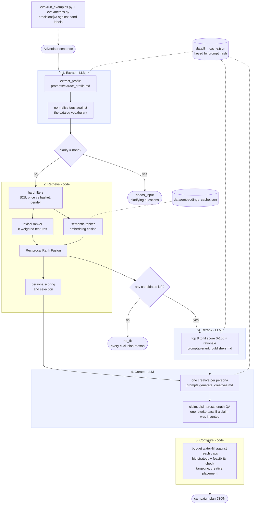

# Architecture

One request in, one plan out. Solid boxes are code, the three shaded stages are LLM calls. Dotted lines are caches and the eval loop.

## Where to read

| File | Owns |
|---|---|
| `app/pipeline.py` | The five stages in order. Start here. Also runnable: `python -m app.pipeline "sentence"` |
| `app/extract.py` + `prompts/extract_profile.md` | Sentence to `AdvertiserProfile`, tag normalisation |
| `app/retrieval.py` | Hard filters, lexical features and weights, semantic scores, RRF, persona selection |
| `app/embeddings.py` | Catalog embeddings, on-disk cache, persona-to-publisher placements |
| `app/rerank.py` + `prompts/rerank_publishers.md` | LLM fit scores and rationales over the shortlist |
| `app/creatives.py` + `prompts/generate_creatives.md` | One creative per persona, claim and disinterest QA, rewrite pass |
| `app/campaign.py` | Budget water-fill, CPM estimates, bid strategy, feasibility, targeting |
| `app/llm.py` | Eden AI client, strict JSON schema calls, prompt loader, response cache |
| `app/schemas.py` | Every data shape: catalog, profile, scores |
| `app/main.py` + `static/` | FastAPI endpoint and the single-page UI |
| `eval/` | 16 sample inputs, hand labels, precision@3 and status checks |
| `tests/` | 12 unit tests for everything that needs no LLM |

## The three exits

- **needs_input**: extraction found no usable signal. The UI shows the clarifying questions and nothing else runs.
- **no_fit**: every publisher failed a hard filter, in practice the B2B rule. The UI lists each exclusion reason.
- **ok**: a full plan. Weak fits are labelled, invented claims are flagged, and the bid box says whether the economics close.
