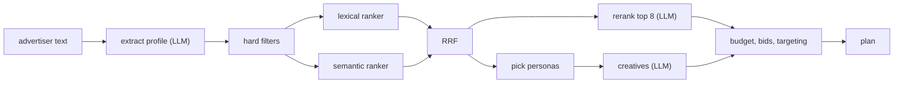

# How it fits together

The text goes through the LLM once and comes back as a structured profile. Everything after that works off the profile, not the raw text. That was the main design call. It keeps the matching deterministic and testable, and it means messy input gets dealt with in one place instead of leaking into every stage.

Retrieval is plain Python. Hard filters throw out what can't work and keep the reason. Two rankers score what's left: one is a weighted sum of features computed from the catalog fields, the other is embedding similarity. RRF merges the two orderings. The reranker only ever sees the top 8, so it can reorder but it can't bring back something a filter removed.

Personas are scored the same way, then each selected persona gets one creative. All of them come from a single LLM call, followed by a code check for claims the advertiser never made and phrases the persona dislikes. If the model invented an offer, it gets one chance to rewrite.

The config is arithmetic on constants I had to make up, all of which are listed in the output. Budget goes out in proportion to fit and is capped by each publisher's reach. Bid strategy depends on the business model. There's a feasibility check that compares what a click costs with what a click can be worth at the target CPA, because for cheap one-time products those two numbers don't meet.

Three ways out: `needs_input` when the text has no signal, `no_fit` when a hard filter removed everything (in practice, B2B), `ok` otherwise.

Where to read: `app/pipeline.py` is the whole flow in about sixty lines. Scoring is in `app/retrieval.py`, the money is in `app/campaign.py`, the LLM plumbing is in `app/llm.py`. Prompts are files under `prompts/`. Responses are cached by prompt hash in `data/llm_cache.json`, which is why the sample chips are instant and give the same answer every time.
